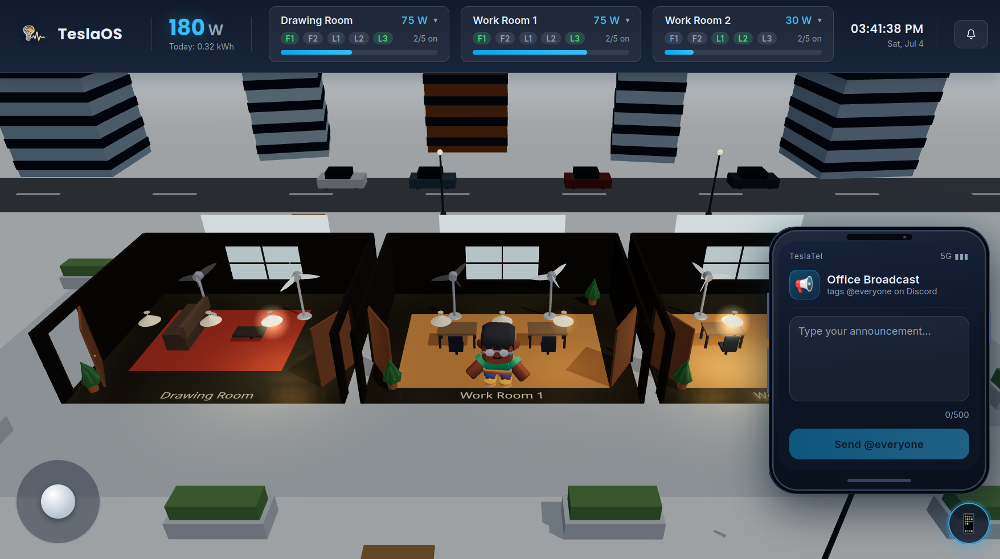
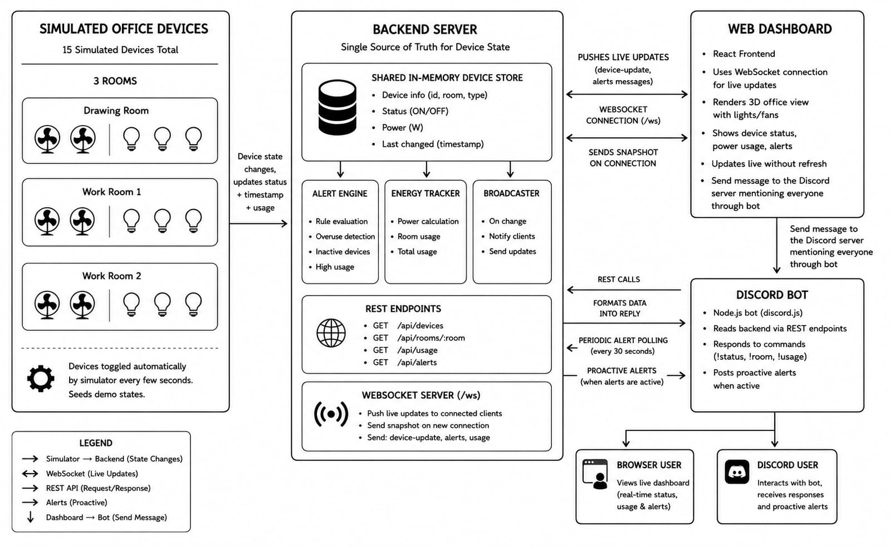

# This is the official readme for IUT technathon

# Office Power Monitor

*Techathon Preliminary — "Lights, Fans, Discord: The Boss's Big Idea"*

A live 3D dashboard and Discord bot for monitoring an office's lights and
fans. One Node.js backend simulates 15 devices across three rooms and acts
as the single source of truth for both clients.

## Overview

| Room | Devices |
|---|---|
| Drawing Room | 2 fans, 3 lights |
| Work Room 1 | 2 fans, 3 lights |
| Work Room 2 | 2 fans, 3 lights |

The simulator ticks every 5 seconds, randomly toggling devices so the
dashboard and bot always have live, changing data to display. From that one
state, the backend derives two things both clients consume: an energy
estimate (kWh today) and rule-based alerts (after-hours usage, rooms left
fully on for 10+ minutes).

<p align="center">
  <br>
  <sub>Web dashboard — live device state, power meter, alerts</sub>
</p>

<p align="center">
  <br>
  <sub>Discord bot — status query and a proactively posted alert</sub>
</p>

## Architecture



```
Device simulator → Backend (REST + WebSocket) → Web dashboard
                                               → Discord bot
```

- **`backend/simulator/deviceStore.js`** — in-memory state for all 15
  devices; the only place device state lives.
- **`backend/simulator/simulateChanges.js`** — ticks every 5s, randomly
  flips 1–3 devices.
- **`backend/alerts.js`** — derives after-hours and continuous-on alerts
  from the current state; no state of its own.
- **`backend/energyTracker.js`** — integrates total wattage over time into
  an estimated kWh-today figure.
- **Dashboard** connects over WebSocket (`/ws`) and receives push updates —
  no polling.
- **Bot** reads over REST (`/api/devices`, `/api/rooms/:room`, `/api/usage`,
  `/api/alerts`), polling `/api/alerts` every 30s to proactively post new
  alerts to a Discord channel.
- Announcements made from the dashboard's in-scene phone are posted to
  `/api/announce`, fanned out over the WebSocket, and picked up by the bot
  as an `@everyone` message — the bot is a WebSocket client like the
  dashboard, not a separate integration.

## Repository layout

| Path | Contents |
|---|---|
| `backend/` | Express REST API + WebSocket server, device simulator, alerts engine, energy tracker |
| `frontend/` | React + react-three-fiber 3D dashboard |
| `bot/` | Discord bot (`!status`, `!room`, `!usage`, `!ask`), with optional LLM-polished replies |
| `diagrams/` | System architecture diagram |
| `hardware/` | Circuit design — pin mapping, wiring, and simulator build notes for one room |

## Getting started

**Requirements:** Node.js 18+ (uses native `fetch`; developed on Node 22).

Run each service in its own terminal. Start the backend first — the
frontend and bot both auto-reconnect, but there's nothing to show until it's
up.

### 1. Backend

```bash
cd backend
npm install
npm start
```

Listens on `http://localhost:4000`, WebSocket at `/ws`. Verify with:
`curl http://localhost:4000/api/usage`

### 2. Frontend

```bash
cd frontend
npm install
cp .env.example .env   # defaults point at localhost:4000
npm run dev
```

Open `http://localhost:5173` — the 3D office, device panel, power meter,
and alerts panel update live, no refresh needed.

### 3. Discord bot

```bash
cd bot
npm install
cp .env.example .env   # fill in DISCORD_TOKEN
npm start
```

**Bot setup:**

1. Create an application and bot at the [Discord Developer Portal](https://discord.com/developers/applications).
2. Under **Bot**, enable **Message Content Intent**.
3. Copy the bot token into `bot/.env` as `DISCORD_TOKEN`.
4. Invite the bot with the `bot` scope and `Send Messages` + `Read Message
   History` permissions.
5. Optional — set `ALERT_CHANNEL_ID` in `bot/.env` to have the bot post
   proactively when an alert fires.
6. Optional — set `GEMINI_API_KEY` in `bot/.env` for LLM-polished replies.
   Without it, the bot uses the template phrasing in `bot/formatters.js`;
   both are built from the same real data.

## API reference

| Endpoint | Method | Description |
|---|---|---|
| `/api/devices` | GET | All 15 devices and their current state |
| `/api/rooms/:room` | GET | Devices in one room (`drawing`, `work1`, `work2`) |
| `/api/usage` | GET | Current wattage and estimated kWh today |
| `/api/alerts` | GET | Active alerts |
| `/api/announce` | POST | Broadcasts `{ message }` to all WebSocket clients |
| `/ws` | WebSocket | Push channel: `snapshot`, `device-update`, `alerts`, `announce` events |

## Discord bot commands

| Command | Description |
|---|---|
| `!status` | Summary of all rooms |
| `!room <drawing\|work1\|work2>` | Status of one room |
| `!usage` | Current power draw and estimated kWh today |
| `!ask <question>` | Free-form question to Gemini (general Q&A, not grounded in office data) |
| `!help` | Lists commands |

## Alert rules

- **After-hours** — a device left on outside 9 AM–5 PM, flagged once it's
  been on for at least a minute (avoids flapping on the simulator's rapid
  toggling).
- **Continuous-on** — every device in a room on at once, for 10+ minutes
  straight.

## Hardware design

`hardware/README.md` covers the electrical design for one room: ESP32 pin
mapping, relay wiring for control, an ACS712 current sensor and a PC817
opto-isolator for independent on/off sensing, and notes on building the
circuit in Wokwi or Tinkercad. It's a design reference — no physical
hardware is required for this deliverable.

## Notes on the simulated data

The device layout (3 rooms × 2 fans @ 60W + 3 lights @ 15W = 165W/room at
full load) is fixed by the problem statement. One light is seeded "on for 3
hours" at startup so an alert is visible immediately in a live demo; after
that, the simulator randomly toggles 1–3 devices every 5 seconds.
