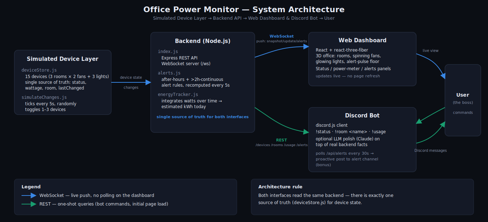

# Office Power Monitor

**Lights, Fans, Discord: The Boss's Big Idea** — a live 3D dashboard and Discord
bot for monitoring an office's lights and fans, built for the Techathon
preliminary round. A single Node.js backend simulates 15 devices across 3
rooms (Drawing Room, Work Room 1, Work Room 2 — 2 fans + 3 lights each) and is
the one source of truth that both the web dashboard and the Discord bot read
from.



## What's here

| Path | What it is |
|---|---|
| `backend/` | Express REST API + WebSocket server, device simulator, alerts engine, energy tracker |
| `frontend/` | React + react-three-fiber 3D dashboard (live device status, power meter, alerts) |
| `bot/` | Discord bot (`!status`, `!room`, `!usage`) reading the same backend, with optional LLM-humanized replies and proactive alert posting |
| `diagrams/` | System architecture diagram (SVG) |
| `hardware/` | Circuit design docs — pin mapping, wiring, and Wokwi/Tinkercad build notes for one room |

## Architecture

```
[Simulated Device Layer] → [Backend API (REST + WebSocket)] → [Web Dashboard] && [Discord Bot] → [User]
```

- `backend/simulator/deviceStore.js` is the single in-memory source of truth for all 15 devices.
- `backend/simulator/simulateChanges.js` ticks every 5s, randomly toggling devices so the demo always has live data.
- `backend/alerts.js` computes after-hours and >2h-continuous-on alerts from that same state.
- `backend/energyTracker.js` integrates total wattage over time into an estimated kWh-today figure.
- The **dashboard** gets push updates over a WebSocket (`/ws`) — no polling, no manual refresh.
- The **bot** reads the same data over REST (`/api/devices`, `/api/rooms/:room`, `/api/usage`, `/api/alerts`) and polls `/api/alerts` every 30s to proactively post new alerts to a Discord channel.

See `diagrams/system-diagram.svg` for the full picture and `hardware/README.md` for the circuit design.

## Prerequisites

- Node.js 18+ (uses native `fetch`; developed on Node 22)
- A Discord bot token if you want to run the bot (see [Discord setup](#discord-bot-setup) below)
- Optionally, an `ANTHROPIC_API_KEY` if you want the bot's replies LLM-polished instead of template-phrased (both are real, non-hardcoded answers either way)

## Running it

Run these three in separate terminals. Order matters only in that the backend should be up before the frontend/bot connect (both auto-reconnect if it isn't).

### 1. Backend

```bash
cd backend
npm install
npm start          # nodemon index.js — http://localhost:4000, WebSocket at /ws
```

Verify it's up: `curl http://localhost:4000/api/usage`

### 2. Frontend (web dashboard)

```bash
cd frontend
npm install
cp .env.example .env   # defaults already point at localhost:4000
npm run dev             # http://localhost:5173
```

Open `http://localhost:5173` — you should see the 3D office, live device panel, power meter, and alerts panel updating every few seconds without a page refresh.

### 3. Discord bot

```bash
cd bot
npm install
cp .env.example .env    # fill in DISCORD_TOKEN (see below); API_BASE_URL defaults to localhost:4000
npm start
```

#### Discord bot setup

1. Create an application + bot at the [Discord Developer Portal](https://discord.com/developers/applications).
2. Under **Bot**, enable the **Message Content Intent** (required to read `!status` etc.).
3. Copy the bot token into `bot/.env` as `DISCORD_TOKEN`.
4. Invite the bot to your server with the `bot` scope and `Send Messages` + `Read Message History` permissions.
5. Optional bonus: set `ALERT_CHANNEL_ID` in `bot/.env` to a channel ID — the bot will proactively post there when an alert condition triggers (e.g. a room left on after hours).
6. Optional: set `ANTHROPIC_API_KEY` in `bot/.env` for LLM-humanized replies. Without it, the bot uses the template phrasing in `bot/formatters.js` — still built from real data, just less conversational.

Bot commands: `!status`, `!room <drawing|work1|work2>`, `!usage`, `!help`.

## Deliverables checklist

- [x] High-level system diagram — `diagrams/system-diagram.svg` (hand-drawn SVG, no Mermaid)
- [x] Hardware/electrical schematic — `hardware/README.md` (pin map + wiring for one room; Wokwi/Tinkercad build notes)
- [x] Simulated device data — `backend/simulator/` (15 devices, dynamic, in-memory)
- [x] Web dashboard — live 3D office (spinning fans, glowing lights), device status panel, power meter, alerts panel, all pushed over WebSocket
- [x] Discord bot — `!status` / `!room` / `!usage`, backed by the same live data, with optional LLM polish and proactive alerts
- [x] Shared backend architecture — one `deviceStore.js`, both interfaces read through the same REST/WebSocket API

## Notes on the simulated data

The device layout is fixed per the problem statement: 3 rooms × (2 fans @ 60W + 3 lights @ 15W) = 15 devices, 165W per room at full load. The simulator seeds one light "on for 3 hours" at startup so the after-hours / continuous-on alert has something to show immediately during a live demo, then randomly toggles 1–3 devices every 5 seconds.
