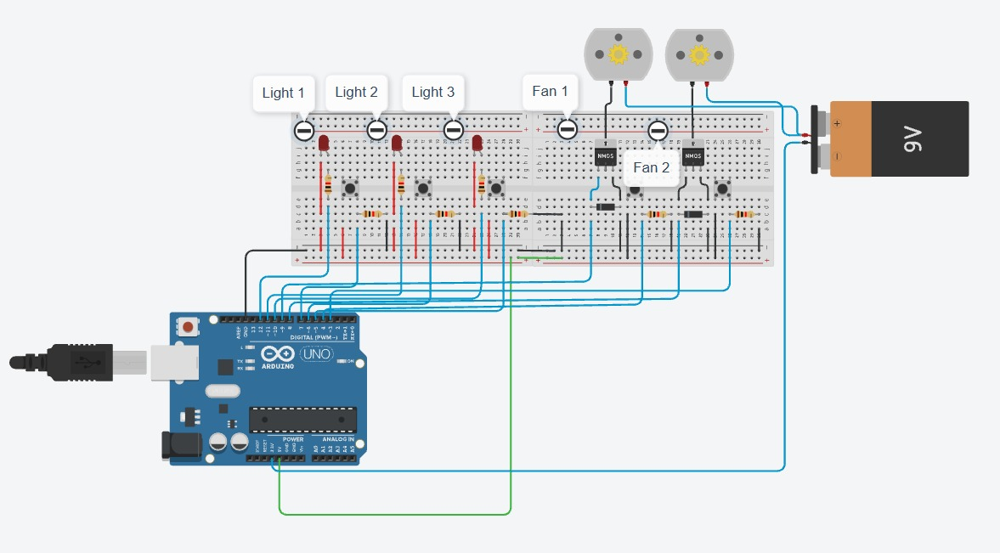

# TeslaOS

*Techathon Preliminary — "Lights, Fans, Discord: The Boss's Big Idea"*

A live 3D dashboard and Discord bot for monitoring an office's lights and
fans. One Node.js backend simulates 15 devices across three rooms and is
the single source of truth for both clients.

## Overview

| Room | Devices |
|---|---|
| Drawing Room | 2 fans, 3 lights |
| Work Room 1 | 2 fans, 3 lights |
| Work Room 2 | 2 fans, 3 lights |

15 devices total. The simulator ticks every 5 seconds, randomly toggling
devices so the dashboard and bot always have live, changing data — from
which the backend derives an energy estimate (kWh today) and rule-based
alerts (after-hours usage, rooms left fully on).

## System architecture

<p align="center">
  <br>
  <sub>Simulated device layer → backend (REST + WebSocket) → web dashboard &amp; Discord bot → people</sub>
</p>

```
Device simulator → Backend (REST + WebSocket) → Web dashboard
                                               → Discord bot
```

- **`backend/simulator/deviceStore.js`** — in-memory state for all 15
  devices; the only place device state lives.
- **`backend/simulator/simulateChanges.js`** — ticks every 5s, randomly
  flips 1–3 devices.
- **`backend/alerts.js`** — derives after-hours and continuous-on alerts
  from the current state; no state of its own.
- **`backend/energyTracker.js`** — integrates total wattage over time into
  an estimated kWh-today figure.
- **`backend/db.js`** — optional MongoDB persistence (device state, hourly
  kWh rollups, alert history). Entirely best-effort: if `MONGODB_URI` isn't
  set or the connection fails, every write becomes a no-op and the app
  keeps running purely in-memory, exactly as before.
- **Dashboard** connects over WebSocket (`/ws`) and receives push updates —
  no polling.
- **Bot** reads over REST (`/api/devices`, `/api/rooms/:room`, `/api/usage`,
  `/api/alerts`, `/api/rooms/:room/report`), polling `/api/alerts` every 30s
  to proactively post new alerts to a Discord channel.
- Announcements made from the dashboard's in-scene phone are posted to
  `/api/announce`, fanned out over the WebSocket, and picked up by the bot
  as an `@everyone` message — the bot is a WebSocket client like the
  dashboard, not a separate integration.

## Web dashboard

<p align="center">
  <br>
  <sub>Web dashboard — live 3D office, device state, power meter, alerts</sub>
</p>

`frontend/` — a React + react-three-fiber 3D office. Rooms, fans, and lights
visually reflect live device state (fans spin, lights glow when ON), with a
walkable avatar (keyboard, joystick, or mouse-click movement), a live power
meter with per-room breakdown, and an alerts panel. Everything updates over
the WebSocket connection — there is no polling and no page refresh.

Each room's table has a floating report marker — hover it and click (no
need to walk the avatar over) to open that room's report: live device
breakdown, last-24h usage, and month-to-date cost/projection. Walking up to
the table still works too as an alternate path.

## Discord bot

*(screenshot: add `diagrams/discord-bot.png` here once captured)*

`bot/` — a discord.js bot that answers `!status`, `!room`, `!usage`,
`!report`, `!ask`, and `!help`, reading from the same backend as the
dashboard so both interfaces always reflect the same reality. `!report`
also takes a free-form follow-up question (e.g. `!report work2 how's this
month looking?`), answered by Gemini grounded strictly in that room's
report data — it's told to say so rather than guess if the facts don't
cover the question. Optional Gemini integration humanizes replies and
proactively posts to a designated channel when an alert fires.

## Hardware / circuit design

<p align="center">
  <br>
  <sub>Concept circuit (Work Room 1) — ESP32, relay modules, ACS712 current sensor, PC817 opto-isolator</sub>
</p>

Public, interactive circuit: [tinkercad.com/things/f2TzNStu8S2-circuitdiagram-iutaccessdenied](https://www.tinkercad.com/things/f2TzNStu8S2-circuitdiagram-iutaccessdenied?sharecode=eXU-W0rWGKZVqE3sbP60KwTWugR9m_Dr4NV5aAKc_yA)

`hardware/README.md` covers the electrical design for one room in detail:
ESP32 pin mapping, relay wiring for control, an ACS712 current sensor and a
PC817 opto-isolator for independent on/off sensing, and the electrical
reasoning behind each choice. It's a design/simulation reference — no
physical hardware is required for this deliverable.

## Repository layout

| Path | Contents |
|---|---|
| `backend/` | Express REST API + WebSocket server, device simulator, alerts engine, energy tracker, optional MongoDB persistence |
| `frontend/` | React + react-three-fiber 3D dashboard |
| `bot/` | Discord bot (`!status`, `!room`, `!usage`, `!report`, `!ask`), with optional LLM-polished replies |
| `diagrams/` | System architecture diagram, dashboard screenshot, circuit schematic |
| `hardware/` | Circuit design — pin mapping, wiring, and simulator build notes for one room |

## Getting started

**Requirements:** Node.js 18+ (uses native `fetch`; developed on Node 22).

Run each service in its own terminal. Start the backend first — the
frontend and bot both auto-reconnect, but there's nothing to show until it's
up.

### 1. Backend

```bash
cd backend
npm install
npm start
```

Listens on `http://localhost:4000`, WebSocket at `/ws`. Verify with:
`curl http://localhost:4000/api/usage`

Optional — set `MONGODB_URI` in `backend/.env` to persist device state,
hourly kWh rollups, and alert history to MongoDB Atlas. Without it (or if
the connection fails), the backend logs "running without persistence" and
keeps working entirely in-memory — nothing else depends on it.

### 2. Frontend

```bash
cd frontend
npm install
cp .env.example .env   # defaults point at localhost:4000
npm run dev
```

Open `http://localhost:5173` — the 3D office, device panel, power meter,
and alerts panel update live, no refresh needed.

### 3. Discord bot

```bash
cd bot
npm install
cp .env.example .env   # fill in DISCORD_TOKEN
npm start
```

**Bot setup:**

1. Create an application and bot at the [Discord Developer Portal](https://discord.com/developers/applications).
2. Under **Bot**, enable **Message Content Intent**.
3. Copy the bot token into `bot/.env` as `DISCORD_TOKEN`.
4. Invite the bot with the `bot` scope and `Send Messages` + `Read Message
   History` permissions.
5. Optional — set `ALERT_CHANNEL_ID` in `bot/.env` to have the bot post
   proactively when an alert fires.
6. Optional — set `GEMINI_API_KEY` in `bot/.env` for LLM-polished replies.
   Without it, the bot uses the template phrasing in `bot/formatters.js`;
   both are built from the same real data. See [Gemini usage](#gemini-usage)
   below for exactly what it's used for.

## Environment variables

Each service loads its own `.env` (copy it from that service's
`.env.example`) — nothing is shared or read across services.

**`backend/.env`**

| Variable | Required | Default | Purpose |
|---|---|---|---|
| `PORT` | no | `4000` | HTTP + WebSocket port |
| `MONGODB_URI` | no | unset | Enables persistence (device state, hourly kWh rollups, alert history). Unset, or unreachable, and the backend logs "running without persistence" and keeps working entirely in-memory |
| `COST_PER_KWH` | no | `8.5` | Tariff used for the room report's cost estimate |
| `CURRENCY` | no | `৳` | Currency symbol shown alongside cost figures |

**`frontend/.env`**

| Variable | Required | Default | Purpose |
|---|---|---|---|
| `VITE_API_URL` | no | `http://localhost:4000/api` | REST base URL (used by the room report modal) |
| `VITE_WS_URL` | no | `ws://localhost:4000/ws` | WebSocket URL for live updates |

**`bot/.env`**

| Variable | Required | Default | Purpose |
|---|---|---|---|
| `DISCORD_TOKEN` | yes | — | Bot login token |
| `API_BASE_URL` | no | `http://localhost:4000/api` | Backend REST base |
| `BACKEND_WS_URL` | no | `ws://localhost:4000/ws` | Backend WebSocket — used only to relay `/api/announce` broadcasts as `@everyone` messages |
| `ALERT_CHANNEL_ID` | no | unset | Channel the bot proactively posts alerts and announcements to; unset disables both |
| `GEMINI_API_KEY` | no | unset | Enables the LLM features below; unset means template phrasing only |

### Gemini usage

Gemini (`gemini-2.5-flash`) is can be used for more interaction — every call
has a 6-second timeout and a clean fallback, so a missing key or a slow/down
API never blocks a reply. Three distinct uses, all in `bot/llm.js`:

- **`humanize(facts)`** — rewrites `!status`, `!room`, `!usage`, and
  `!report`'s already-correct fact string into one friendlier sentence. It's
  instructed not to introduce numbers beyond what's given; the un-polished
  `facts` string is the fallback if the call fails.
- **`chat(question)`** — powers `!ask`, a general-purpose assistant *not*
  grounded in office data. Returns `null` on failure, and the bot tells the
  user Gemini isn't available rather than guessing.
- **`askAboutReport(question, facts)`** — powers `!report <room> <question>`,
  instructed to answer strictly from that room's report facts and to say so
  honestly if the facts don't cover the question, instead of inventing one.

Without `GEMINI_API_KEY`, every command still works and still reflects real
simulated data — replies just skip the LLM rewrite and use the plain
template phrasing from `bot/formatters.js`, and `!ask` / the grounded
`!report` follow-up reply that Gemini isn't available.

## API reference

| Endpoint | Method | Description |
|---|---|---|
| `/api/devices` | GET | All 15 devices and their current state |
| `/api/rooms/:room` | GET | Devices in one room (`drawing`, `work1`, `work2`) |
| `/api/usage` | GET | Current wattage and estimated kWh today |
| `/api/alerts` | GET | Active alerts |
| `/api/energy/history` | GET | Hourly kWh rollups (`?hours=`, `?room=`); `[]` without a database |
| `/api/rooms/:room/report` | GET | Live state + last-24h kWh + month-to-date cost/projection for one room |
| `/api/announce` | POST | Broadcasts `{ message }` to all WebSocket clients |
| `/ws` | WebSocket | Push channel: `snapshot`, `device-update`, `alerts`, `announce` events |

## Discord bot commands

| Command | Description |
|---|---|
| `!status` | Summary of all rooms |
| `!room <drawing\|work1\|work2>` | Status of one room |
| `!usage` | Current power draw and estimated kWh today |
| `!report <room>` | Live state, last-24h kWh, and month-to-date cost/projection for one room |
| `!report <room> <question>` | Same report data, but asks Gemini your question grounded strictly in it |
| `!ask <question>` | Free-form question to Gemini (general Q&A, not grounded in office data) |
| `!help` | Lists commands |

## Alert rules

- **After-hours** — a device left on outside 9 AM–5 PM, flagged once it's
  been on for at least a minute (avoids flapping on the simulator's rapid
  toggling).
- **Continuous-on** — every device in a room on at once, for 10+ minutes
  straight. (Shortened from a "realistic" 2 hours so the alert is actually
  observable during a live demo, given the simulator's fast random
  toggling — documented in `backend/alerts.js`.)

## Notes on the simulated data

The device layout (3 rooms × 2 fans @ 60W + 3 lights @ 15W = 165W/room at
full load) is fixed by the problem statement. One light is seeded "on for 3
hours" at startup so an alert is visible immediately in a live demo; after
that, the simulator randomly toggles 1–3 devices every 5 seconds.
